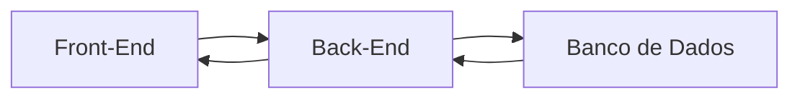

# Meu Curso Desenvolvimento com antigravity

**Início:** 19/09/2026
**Local:** Escola SENAI Americana

## Módulo 1 - Introdução & Nivelamento

- Hardware, Software, SOs

- Preperando o Ambiente de desenvolvimento
    - *VScode*: Editor de texto/IDE;
    - *Criação da Workspace;
    - Arquivos e Extensões;
    - Software de Versionamento
    > Versionamento: proocesso de registrar e gerenciar todas as altereções feitas nos arquivos de uma projeto ao longo do tempo.
        - GIT: Versionamento Local;
        - GITHUB: Versionamento na Nuvem
### Configurando o GIT e o GITHUB
Conectar Git ao GITHUB, comando:
`git config --global user.name "Paulo23k"`
`git config --global user.email "email@email.com"`
Confirmar com comando:
`git config --list`

### O Processo de Desenvolvimento

**"Como um Software é Feito"**
* Programar é dar ordems extremamente detalhadas e lógicas para o computador. É como escrever uma receita de bolo passo a passo.

**Arquitetura Básica de uma software**

* Front-End (A interface): É tudo que o usuário final, vê, clica, e interage.
* Back-End (O Cérebro): É a cozinha do Restaurante. Recebe as requisições, processa de acordo com a lógica e devolve uma resposta para UI(User Interface).
* Banco de Dados (A memória): É onde guardamos as informações permanentes: logins, senhas, históricos, mensagens...

### Projeto Antigravity

**O Contexto (O que vamos construir)**

* Gerenciador de Tarefas: HTML, CSS, JS
* O Prompt para o Antigravity:

"Atue como um desenvolvedor web sênior. Quero criar um aplicativo de 'Lista de Tarefas' simples e bonito. Por favor, gere os 3 arquivos necessários (HTML, CSS e JavaScript) seguindo estas regras:

1. Front-end (Interface - HTML e CSS):
Crie um título centralizado chamado 'Meu Dia'.
Crie um campo de texto para digitar a tarefa e um botão azul escrito 'Adicionar'.
Abaixo, crie uma lista onde as tarefas vão aparecer.
Use um design moderno, com cantos arredondados e fundo claro.

2. Back-end/Lógica (JavaScript):
Quando eu clicar em 'Adicionar', a tarefa deve ir para a lista.
Se o campo estiver vazio, mostre um alerta pedindo para digitar algo.
Coloque um botão vermelho de 'Excluir' do lado de cada tarefa.

3. Banco de Dados / Memória:
Use o 'LocalStorage' do navegador para salvar as tarefas. Assim, se eu fechar a página e abrir de novo, minhas tarefas ainda estarão lá.
Forneça o código completo e separado de cada arquivo."