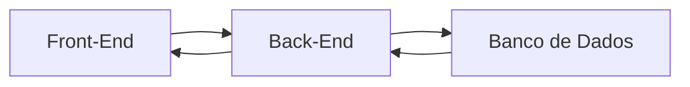
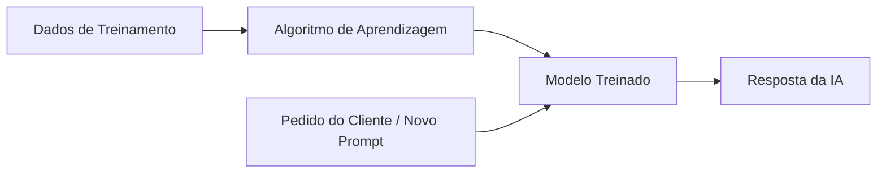

# Meu Curso Desenvolvimento com antigravity

**Início:** 19/09/2026
**Local:** Escola SENAI Americana

## Módulo 1 - Introdução & Nivelamento

- Hardware, Software, SOs

- Preperando o Ambiente de desenvolvimento
    - *VScode*: Editor de texto/IDE;
    - *Criação da Workspace;
    - Arquivos e Extensões;
    - Software de Versionamento
    > Versionamento: proocesso de registrar e gerenciar todas as altereções feitas nos arquivos de uma projeto ao longo do tempo.
        - GIT: Versionamento Local;
        - GITHUB: Versionamento na Nuvem
### Configurando o GIT e o GITHUB
Conectar Git ao GITHUB, comando:
`git config --global user.name "Paulo23k"`
`git config --global user.email "email@email.com"`
Confirmar com comando:
`git config --list`

### O Processo de Desenvolvimento

**"Como um Software é Feito"**
* Programar é dar ordems extremamente detalhadas e lógicas para o computador. É como escrever uma receita de bolo passo a passo.

**Arquitetura Básica de uma software**

* Front-End (A interface): É tudo que o usuário final, vê, clica, e interage.
* Back-End (O Cérebro): É a cozinha do Restaurante. Recebe as requisições, processa de acordo com a lógica e devolve uma resposta para UI(User Interface).
* Banco de Dados (A memória): É onde guardamos as informações permanentes: logins, senhas, históricos, mensagens...

```mermaid

flowchart LR
    A[Front-End]
    B[Back-End]
    C[Banco de Dados]

    A --> B
    B --> C
    C --> B
    B --> A

```

### Projeto Antigravity

**O Contexto (O que vamos construir)**

* Gerenciador de Tarefas: HTML, CSS, JS
* O Prompt para o Antigravity:

"Atue como um desenvolvedor web sênior. Quero criar um aplicativo de 'Lista de Tarefas' simples e bonito. Por favor, gere os 3 arquivos necessários (HTML, CSS e JavaScript) seguindo estas regras:

1. Front-end (Interface - HTML e CSS):
Crie um título centralizado chamado 'Meu Dia'.
Crie um campo de texto para digitar a tarefa e um botão azul escrito 'Adicionar'.
Abaixo, crie uma lista onde as tarefas vão aparecer.
Use um design moderno, com cantos arredondados e fundo claro.

2. Back-end/Lógica (JavaScript):
Quando eu clicar em 'Adicionar', a tarefa deve ir para a lista.
Se o campo estiver vazio, mostre um alerta pedindo para digitar algo.
Coloque um botão vermelho de 'Excluir' do lado de cada tarefa.

3. Banco de Dados / Memória:
Use o 'LocalStorage' do navegador para salvar as tarefas. Assim, se eu fechar a página e abrir de novo, minhas tarefas ainda estarão lá.
Forneça o código completo e separado de cada arquivo."

## Módulo 2 - O Mundo da IA Generativa e o Levantamento de Requisitos

### A Base da Inteligência Artificial - Dados, Algoritmos e Modelos

```mermaid
flowchart LR
    A[Dados de Treinamento]
    B[Algoritmo de Aprendizagem]
    C[Modelo Treinado]
    D[Pedido do Cliente / Novo Prompt]
    E[Resposta da IA]

    A --> B
    B --> C
    C --> E
    D --> C

```

1. **Os dados**:
   * Sem dados, não existe aprendizado. No mundo digital, os dados são bibliotecas inteiras de textos, páginas da web, repositórios de código aberto (como o GitHub), manuais técnicos, imagens e conversas.
   * Quanto maior o volume, a diversidade e a qualidade dos dados, melhor será a base de conhecimento disponível.

2. **O Algoritmo**:
    * O algoritmo não é a inteligência em si; é o **método matemático** pelo qual a máquina lê os dados, identifica padrões, ajusta erros e calibra seus cálculos.

3. **O Modelo**:
    * Após meses de processamento massivo em supercomputadores na nuvem consumindo petabytes de dados através de algoritmos complexos, o resultado final gerado é um arquivo com bilhões de pesos matemáticos chamado **Modelo**

> Obs: Quando você abre o chat ou utiliza uma API de IA, você não está conversando com a internet em tempo real nem com um algoritmo em treinamento; você está interagindo diretamente com o **Modelo**, que é o cérebro consolidado contendo os padrões aprendidos.

### IA Tradicional  vs. IA Generativa

A IA Tradicional foca em responder perguntas como:
* *"Esta transação com cartão de crédito é legítima ou fraudulenta?"*
* *"Este e-mail recebido é spam ou prioritário?"*
* *"Qual a chance de chover em Curitiba amanhã?"*
* *"Qual filme do catálogo da Netflix este usuário provavelmente assistirá?"*

A IA Generativa dá um salto conceitual: a partir dos padrões absorvidos durante o treinamento, ela é capaz de **gerar artefatos digitais totalmente novos e inéditos**.
* Ela não faz apenas a busca de um texto pronto em um banco de dados; ela escreve palavra por palavra uma dissertação inédita.
* Ela não copia um layout existente; ela projeta uma tela em HTML/CSS baseada nas instruções recebidas.
* Ela não apenas classifica uma imagem médica; ela pode gerar representações sintéticas para pesquisa.

### LLM (Large Language Model): Como funciona um Modelo de Linguagem?

1. **Token**: O texto de entrada não é lido pelo modelo como palavras inteiras. Ele é decomposto em fragmentos (Tokens). Um texto com 100 caractéres irá consumir aproximadamento 25 tokens (num texto padrão em inglês)

2. **Previsão Sequencial**: A tarefa primária de um LLM é calcular continuamente os `Dados do Contexto` --> qual é o proximo `token` mais provável? 

3. **Padrão e Contexto**: Ao Analisar bilhoes de linhas de códigos e textos de alta qualidade, o modelo aprende que apos uma tokens qual é o próximo token. 
Ex: function `somaNumeros`( é matematicamente provável que venha os parâmetros da função) a sugestão da IA é `(numero1 , numero2)`

### o Desenvolvimento com Uso da IA

### **"Horta-na-Mão" (Assinatura de Orgânicos)**

**Contexto:** Focado em saúde e recorrência. O cliente não compra uma vez só, ele assina uma cesta semanal.

**O Briefing do Cliente:**

 "Eu quero digitalizar meu clube de orgânicos. 

**Requisito1:** O esquema é o seguinte: o cliente escolhe um plano (Pequeno, Médio ou Grande) e recebe toda terça-feira.
**Requisito2:** O sistema deve permitir que o cliente altere os itens das cestas até domingo a noite.
**Requisito3:**O entregador precisa tirar uma foto da cesta na porta do cliente para provar que entregou, já que muita gente mora em casa e não tem porteiro."
**Regra1:** Mas atenção: ele só pode trocar os itens da cesta até domingo à noite; se passar disso, vai o que tiver na horta
**Reegra2:** O pagamento tem que ser recorrente no cartão de crédito, estilo Netflix.
**Restrição1** Outra coisa, só entregamos na Zona Sul da cidade porque meu caminhão é velho e não aguenta subir ladeira.

